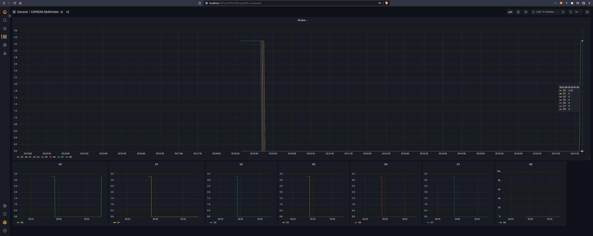
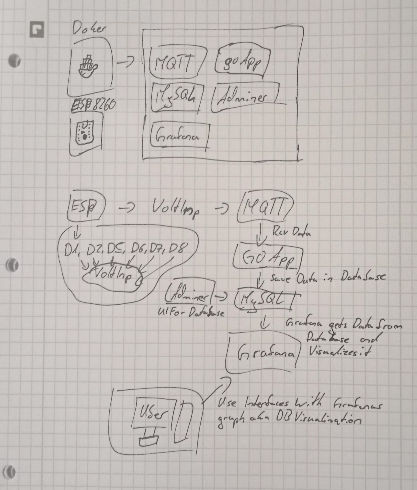

# ESP8266-MultiMeter
A MultiMeter built using an ESP8266 (d1 mini lite) 
To explain the circuit very simple: there are positive / negative inputs connected to `A0`, `D0`, `D5`, `D6` and `D7` Those will be posted to the database and then shown in a grafana board 
I also added code to be able to connect a screen to the ESP and it should work fine and display some information about the (`A0`) input, pins are: `SCL` -> `D1`, `SDC` -> `D2`, and VCC, GND to `3.3` and `G`/`GND` 

It uses [MySQL](https://www.mysql.com/) as a database, [eclipse mosquitto](https://mosquitto.org/) as MQTT broker, [GoLang](https://go.dev/) to send data recieved from MQTT to the database and [PlatformIO](https://platformio.org/) / Embedded C++ for the [ESP8266 D1-Mini-Lite](https://www.amazon.com/dp/B08HH96RJY) (you can use whatever ESP you want, i dont know if it will work tho) 

`A0` is the `Analog` pin, it can read actuall input inbetween `0` and `3.3`, the `DX` pins can only measure from `0` to `3.3` 
Aka if you want "acurate" data not only `0` and `3.3`, use the `A0` pin otherwise (only `0` and `3.3` data) use the `DX` pins

### How to use
Its simple: 
1. Install docker: [here is a guide on how to do that](https://docs.docker.com/engine/install/)
2. Run `make` in the root directory of the project, this will install all images needed and run everything you need automatically
3. Create `config.h` file in `ESP/src` folder using the [sample file](./ESP/src/config.h.sample), this will contain all data that the ESP needs to connect to your "`docker server`"
4. Wire your ESP up
    - connect `D3` to LED's (`+`) and connect the `-` of the LED's to the ESP's `GND` pin
    - connect `A0`, `D0`, `D5`, `D6` and `D7` to cables, those will be the inputs that are going to be measured
5. upload the contents of the [`ESP`](./ESP/) folder to an ESP (8266 D1 Mini) using PlatformIO
6. Thats it, it should now work fine and run without any problems

### Bugs
Current Bugs:
 - Go will add about 200 new entries to database when recieves something trough mqtt
 - Go output is weird

### ToDos
 - Dimm LED's
 - Fix cables
 - Fix Go

### Features
 - ESP8266 programm to get voltage input data for D0-D8 pins and send them to MQTT Server
 - Mosquitto/MQTT, MySQL, Grafana, Adminer and GoBackend, all inside a single docker container / docker-compose "container"
 - GoBackend that receives data from MQTT and posts it to the MySQL Database

### Why?
My MultiMeter broke <!-- and I had nothing to do -->

  

I think this kinda explains how it works

<!--  -->
